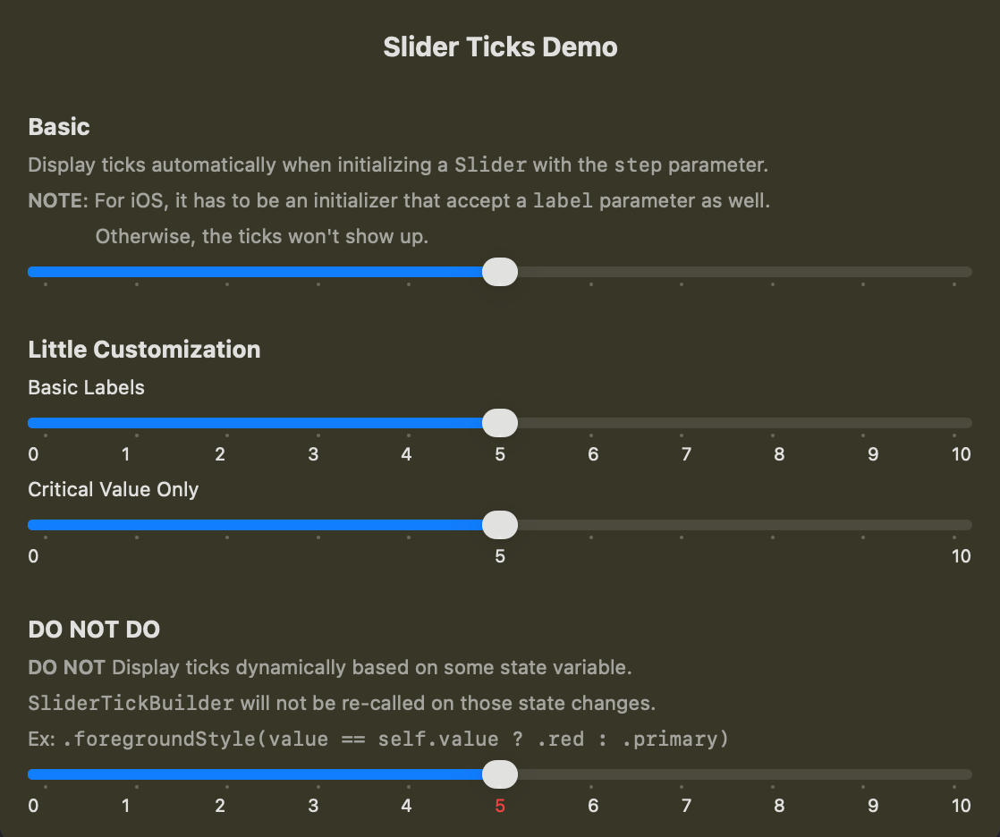

# SwiftUI_SliderTickDemo

A demo of the slider ticks that is supported starting from iOS26, macOS 26, and etc.

For more details, please refer to my article: [SwiftUI: Slider With Ticks. Basic Usage, Customization, and What NOT TO DO!](https://medium.com/@itsuki.enjoy/swiftui-slider-with-ticks-basic-usage-customization-and-what-not-to-do-07626e3619af)

